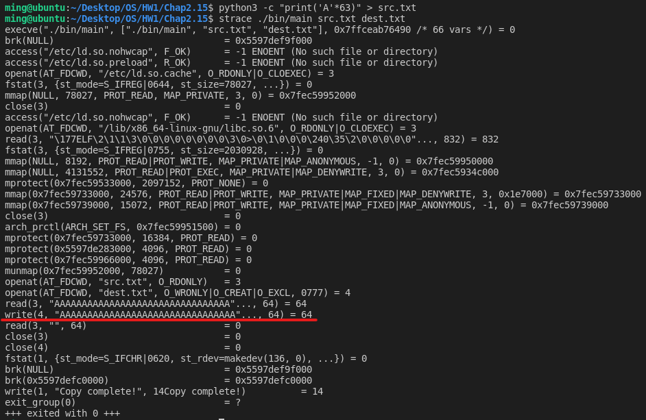
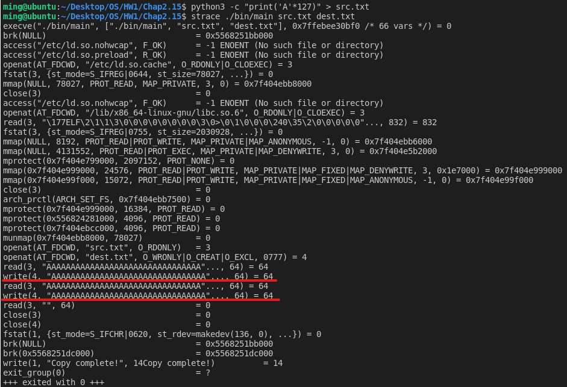
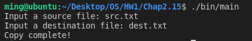
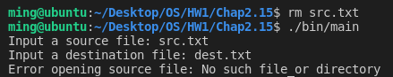
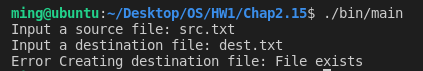

# [2966473] 110-2 Operating System

## Homework Assignment #1

### 108590050 李浩銘

#### Programming problem 2.15

In Sec.2.3, we described a program that copies the contents of one file to a destination file. This program works by first prompting the user for the name of the source and destination files.  

Write this program using either the **Windows or POSIX API**.

- Be sure to include all necessary error checking, including ensuring that the source file exists.

Once you have correctly designed and tested the program, if you used a system that supports it, run the program using a utility that traces system calls.

- Linux systems provide the **strace** utility, and
- Solaris and Mac OS X systems use the **dtrace** command
- As Windows systems do not provide such features, you will have to trace through the Windows version of this program using a debugger.

### Development Environment

- Operating System: Ubuntu 18.04.6 LTS
- Kernel Version: 5.4.0-104-generic
- Compiler Version: gcc 7.5.0

### Build

To compile the source files

```bash
make
```

To clean the object and binary files

```bash
make clean
```

### Usage

```bash
./bin/main -h
./bin/main --help
```

Basic usage

```bash
./bin/main
```

Input with arguments

```bash
./bin/main <src> <dest>
```

### Execution snapshot

First thing first, let's look at the `src/main.c`, I define the size of buffer as 64 bytes.

```c
#define BUF_SIZE 64
```

Therefore, I create a text file `src.txt` with 63 bytes of character and 1 byte of new line character `\n`.



As the picture show above, the program will read the source file and write to the destination file **once**. After that, the program read `EOF` then close those two files.



Here, I create a text file `src.txt` with 127 bytes of character and 1 byte of new line character `\n`. As expect, the program will read the source file and write to the destination file **twice**. After that, the program read `EOF` then close those two files.

Copy successfully



#### Error checking

Source file does not exist

```c
int inFd;
if ((inFd = open(f1, O_RDONLY)) == -1)  // If file doesn't exist
{   
    // Abort
    perror("Error opening source file");    
    exit(EXIT_FAILURE);
}
```



Destination file already exist

```c
int outFd;
if ((outFd = open(f2, O_EXCL | O_CREAT | O_WRONLY, S_IRWXU | S_IRWXG | S_IRWXO)) == -1) // If file exists
{   
    // Abort
    perror("Error creating destination file");
    close(inFd);
    exit(EXIT_FAILURE);
}
```


