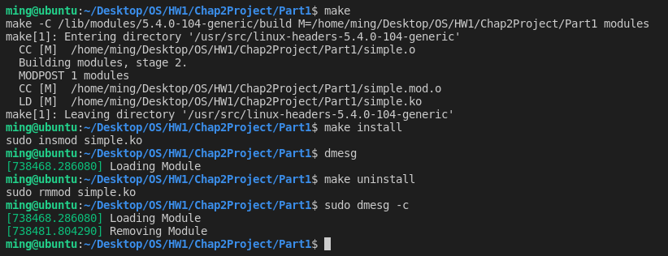
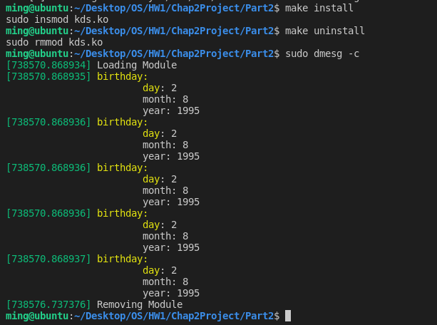

# [2966473] 110-2 Operating System

## Homework Assignment #1

### Programming Project

#### Chap.2 Project Linux Kernel Modules

#### Team Member
- 108590002 謝宗麟
- 108590029 朱欣雨
- 108590049 符芷琪
- 108590050 李浩銘

Part I: Creating, loading, and removing kernel modules
- Assignment: Proceed through the steps described above to create the kernel module and to load and unload the module. Be sure to check the counters of the kernel log buffer using *dmesg* to ensure you have properly followed the steps.

Part II: Creating, traversing, and deleting kernel data structures
- In the module entry point, create a linked list containing five *struct_birthday* elements. Traverse the linked list and output its contents to the kernel log buffer. Invoke the *dmesg* command to ensure the list is properly constructed once the kernel module has been loaded.
- In the module exit point, delete the elements from the linked list and return the free memory back to the kernel. Again, invoke the *dmesg* command to check that the list has been removed once the kernel module has been unloaded.

### Development Environment
- Operating System: Ubuntu 18.04.6 LTS
- Kernel Version: 5.4.0-104-generic
- Compiler Version: gcc 7.5.0

### Build
To compile the source files
```bash
$ make
```

To clean the object and binary files
```bash
$ make clean
```

### Usage
To install the kernel modeule
```bash
$ make install
```

To uninstall the kernel modeule
```bash
$ make uninstall
```

### Execution snapshot
#### Part 1


#### Part 2
