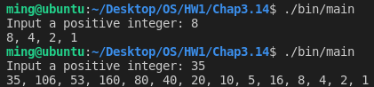
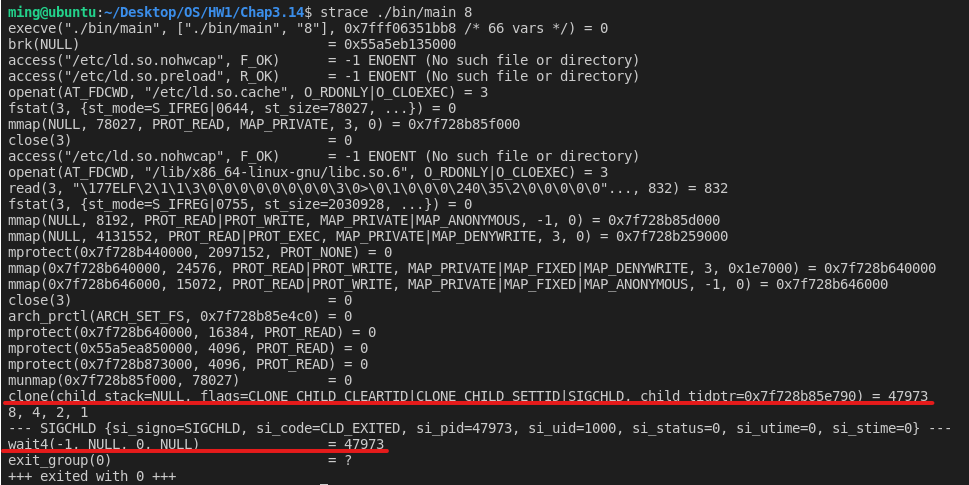
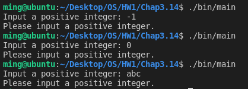

# [2966473] 110-2 Operating System

## Homework Assignment #1

### 108590050 李浩銘

#### Programming problem 3.14

The Collatz conjecture concerns what happens when we take any positive integer n and apply the following algorithm:
> n = n/2, if n is even  
> n = 3*n+1, if n is odd

The conjecture states that when this algorithm is continually applied, all positive integers will eventually reach 1.

For example, if n=35, the sequence is: 35, 106, 53, 160, 80, 40, 20, 10, 5, 16, 8, 4, 2, 1.

Write a C program using the **fork()** system call that generates this sequence in the child process. The starting number will be provided from the command line.

- For example, if 8 is passed as a parameter on the command line, the child process will output 8, 4, 2, 1.

Because the parent and child processes have their own copies of the data, it will be necessary for the child to output the sequence.

Have the parent invoke the wait() call to wait for the **child** process to complete before exiting the program.

Perform necessary error checking to ensure that a positive integer is passed on the command line.

### Development Environment

- Operating System: Ubuntu 18.04.6 LTS
- Kernel Version: 5.4.0-104-generic
- Compiler Version: gcc 7.5.0

### Build

To compile the source files

```bash
make
```

To clean the object and binary files

```bash
make clean
```

### Usage

```bash
./bin/main -h
./bin/main --help
```

Basic usage

```bash
./bin/main
```

Input with arguments

```bash
./bin/main <num>
```

### Execution snapshot





As the picture show above, the program forks a child process and prints the result.  
On the another hand, the parent process waits the child process to finish.

#### Error Checking

Inputting a non-positive integer or even non-integer


