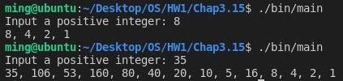
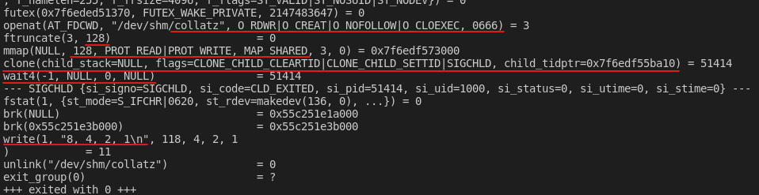
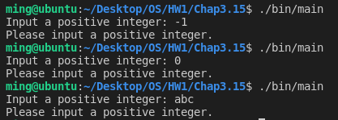

# [2966473] 110-2 Operating System

## Homework Assignment #1

### 108590050 李浩銘

#### Programming problem 3.15

In Exercise 3.14, the child process must output the sequence of numbers generated from the algorithm specified by the Collatz conjecture because the parent and child processes have their own copies of the data.

Another approach to redesign this program is to establish a **shared-memory object** between the parent and child processes. This technique allows the child to write the contents of the sequence to the shared-memory object. The parent can then output the sequence when the child completes.

Because the memory is shared, any changes the child makes will be reflected in the parent process as well.

This program will be structured using **POSIX shared memory** as described in Sec.3.5.1. The parent process will progress though the following steps:

- Establish the shared-memory object (shm_open(), ftruncate(), and mmap())
- Create the child process and wait for it to terminate
- Output the contents of shared memory
- Remove the shared-memory object

One area of concern with cooperating process involves synchronization issues. In this exercise, the parent and child processes must be coordinated so that the parent does not output the sequence until the child finishes execution. These two processes will be synchronized using the wait() system call: the parent process will invoke wait(), which will suspend until the child process exits.

### Development Environment

- Operating System: Ubuntu 18.04.6 LTS
- Kernel Version: 5.4.0-104-generic
- Compiler Version: gcc 7.5.0

### Build

To compile the source files

```bash
make
```

To clean the object and binary files

```bash
make clean
```

### Usage

```bash
./bin/main -h
./bin/main --help
```

Basic usage

```bash
./bin/main
```

Input with arguments

```bash
./bin/main <num>
```

### Execution snapshot





As the picture show above, the program creates a shared memory and forks a child process.  
The child process will write the reesult to the shared memory.  
On the another hand, the parent process waits the child process to finish, then print out the result.

#### Error Checking

Inputting a non-positive integer or even non-integer


