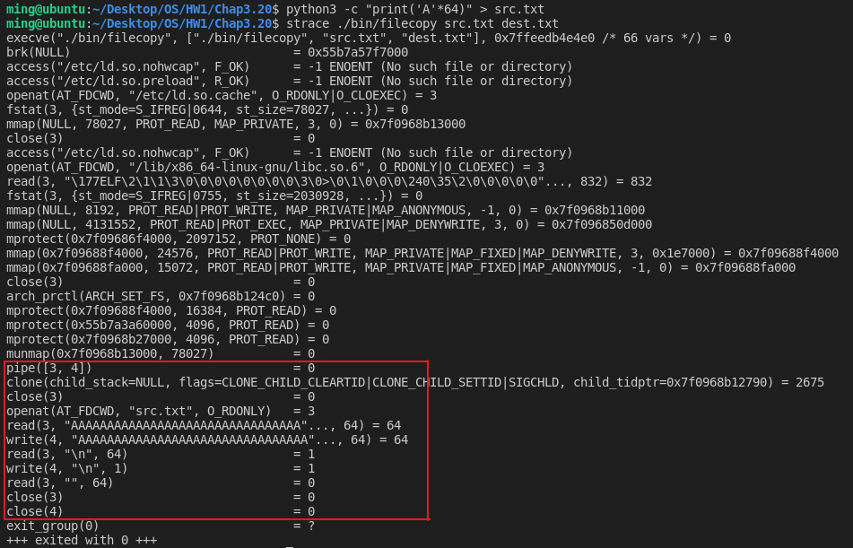
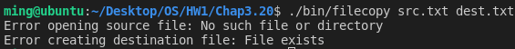

# [2966473] 110-2 Operating System

## Homework Assignment #1

### 108590050 李浩銘

#### Programming problem 3.20

Design a file-copying program named filecopy using ordinary pipes. 
- This program will be passed two parameters: the name of the file to be copied, and the name of the copied file
- The program will then create an ordinary pipe and write the contents of the file to be copied to the pipe
- The child process will read this file from the pipe and write it to the destination file

For example, if we invoke the program as follows:
- filecopy input.txt copy.txt
- The file input.txt will be written to the pipe. The child process will read the contents of this file and write it to the destination file copy.txt. 

You may write this program using either UNIX or Windows pipes.

### Development Environment
- Operating System: Ubuntu 18.04.6 LTS
- Kernel Version: 5.4.0-104-generic
- Compiler Version: gcc 7.5.0

### Build
To compile the source files
```bash
$ make
```

To clean the object and binary files
```bash
$ make clean
```

### Usage
```bash
$ ./bin/filecopy -h
$ ./bin/filecopy --help
```

```bash
$ ./bin/filecopy <src> <dest>
```

### Execution snapshot


#### Error checking

