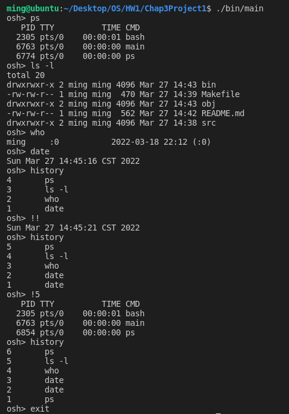

# [2966473] 110-2 Operating System

## Homework Assignment #1

### Programming Project

#### Chap.3 Project 1 UNIX Shell and History Feature

This project consists of designing a C program to serve as a shell interface that accepts user commands and then executes each command in a separate process

Part I - Creating a child process to execute a command

- The first task is to modify the main() function is Fig. 3.35 so that a child process is forked and executes the command specified by the user.

Part II - Creating a history feature

- The next task is to modify the shell interface program so that it provides a history feature that allows the user to access the most recently entered commands.

#### Team Member

- 108590004 謝宗麟
- 108590029 朱欣雨
- 108590049 符芷琪
- 108590050 李浩銘

### Development Environment

- Operating System: Ubuntu 18.04.6 LTS
- Kernel Version: 5.4.0-104-generic
- Compiler Version: gcc 7.5.0

### Build

To compile the source files

```bash
make
```

To clean the object and binary files

```bash
make clean
```

### Usage

```bash
./bin/main
```

### Execution snapshot


