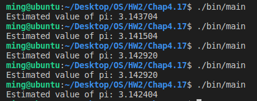

# [2966473] 110-2 Operating System

## Homework Assignment #2

### 108590050 李浩銘

#### Programming problem 4.17

An interesting way of calculating pi is to use a technique known as *Monte Carlo*, which involves randomization. This technique works as follows:

- Suppose you have a circle inscribed within a square, (Assume that the radius of this circle is 1.)
- First, generate a series of random points as simple (x,y) coordinates.
- These points must fall within the Cartesian coordinates that bound the square.
- Of the total number of random points that are generated, some will occur within the circle.
- Next, estimate pi by performing the following calculation:
  > Pi = 4 * (number of points in circle) / (total number of points)

Write a **multithreaded** version of this algorithm that creates a separate thread to generate a number of random points.

- The thread will count the number of points that occur within the circle and store that result in a global variable.
- When this thread has exited, the parent thread will calculate and output the estimated value of pi.

### Development Environment

- Operating System: Ubuntu 18.04.6 LTS
- Kernel Version: 5.4.0-104-generic
- Compiler Version: gcc 7.5.0

### Build

To compile the source files

```bash
make
```

To clean the object and binary files

```bash
make clean
```

### Usage

Basic usage

```bash
./bin/main
```

### Execution snapshot


