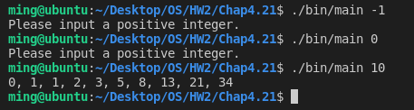

# [2966473] 110-2 Operating System

## Homework Assignment #2

### 108590050 李浩銘

#### Programming problem 4.21
The *Fibonacci sequence* is the series of numbers 0, 1, 1, 2, 3, 5, 8, … . Formally, it can be expressed as:
> fib(0) = 0  
> fib(1) = 1  
> fib(n) = fib(n-1) + fib(n-2)

Write a **multithreaded** program that generates the Fibonacci sequence using either the **Java, Pthread, or Win32** thread library.

This program should work as follows: 
- On the command line, the user will enter the number of Fibonacci numbers that the program is to generate. 
- The program will then create a separate thread that will generate the Fibonacci numbers, placing the sequence in data that can be shared by the threads (an array is probably the most convenient data structure). 
- When the thread finishes execution, the parent thread will output the sequence generated by the child thread. 
- Because the parent thread cannot begin outputting until the child finishes, the parent will have to wait for the child thread to finish.

### Development Environment
- Operating System: Ubuntu 18.04.6 LTS
- Kernel Version: 5.4.0-104-generic
- Compiler Version: gcc 7.5.0

### Build
To compile the source files
```bash
$ make
```

To clean the object and binary files
```bash
$ make clean
```

### Usage
Basic usage
```bash
$ ./bin/main <num>
```

### Execution snapshot
