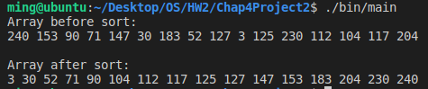

# [2966473] 110-2 Operating System

## Homework Assignment #2

### Programming Project

#### Chap.4 Project 2 Multithreaded sorting application

Write a multithreaded sorting program that works as follows:
> A list of integers is divided into two smaller lists of equal size.  
> Two separate threads sort each sublist using a sorting algorithm of your choice.  
> The two sublists are then merged by a third thread.

#### Team Member

- 108590002 謝宗麟
- 108590029 朱欣雨
- 108590049 符芷琪
- 108590050 李浩銘

### Development Environment

- Operating System: Ubuntu 18.04.6 LTS
- Kernel Version: 5.4.0-104-generic
- Compiler Version: gcc 7.5.0

### Build

To compile the source files

```bash
make
```

To clean the object and binary files

```bash
make clean
```

### Usage

```bash
./bin/main
```

```bash
./bin/main -h
./bin/main --help
```

### Execution snapshot

