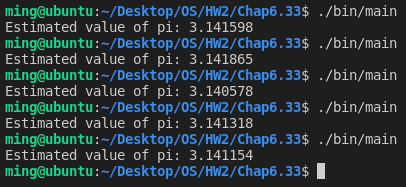

# [2966473] 110-2 Operating System

## Homework Assignment #2

### 108590050 李浩銘

#### Programming problem 6.33

Modify the program in Exercise 4.17 so that you create several threads, each of which generates random points and determines if the points fall within the circle.

- Each thread will have to update the global count of all points that fall within the circle.
- Protect against race conditions on updates to the shared global variable by using mutex locks.
- (Note: You can use mutex lock or semaphores in Pthread, or Windows API if you want.)

### Development Environment

- Operating System: Ubuntu 18.04.6 LTS
- Kernel Version: 5.4.0-104-generic
- Compiler Version: gcc 7.5.0

### Build

To compile the source files

```bash
make
```

To clean the object and binary files

```bash
make clean
```

### Usage

Basic usage

```bash
./bin/main
```

### Execution snapshot


