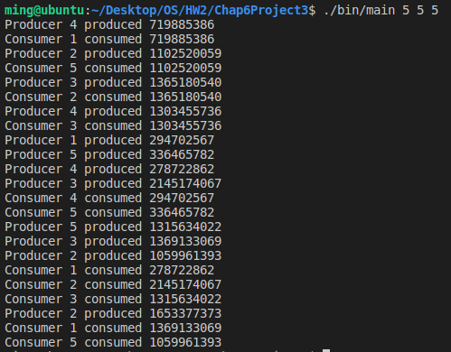

# [2966473] 110-2 Operating System

## Homework Assignment #2

### Programming Project

#### Chap.6 Project 3 Producer-Consumer Problem

- Use standard counting semaphores for empty and full and a mutex lock, rather than a binary semaphore, to represent mutex.
- Producer and consumer threads
- Pthreads mutex locks/semaphores
- Windows mutex locks/semaphores

#### Team Member

- 108590002 謝宗麟
- 108590029 朱欣雨
- 108590049 符芷琪
- 108590050 李浩銘

### Development Environment

- Operating System: Ubuntu 18.04.6 LTS
- Kernel Version: 5.4.0-104-generic
- Compiler Version: gcc 7.5.0

### Build

To compile the source files

```bash
make
```

To clean the object and binary files

```bash
make clean
```

### Usage

Using the solution provide by the text-book

> Help
> 
> ```bash
> ./bin/main -h
> ./bin/main --help
> ```

```bash
./bin/main <sleepTime> <num of producer> <num of consumer>
```

### Execution snapshot


