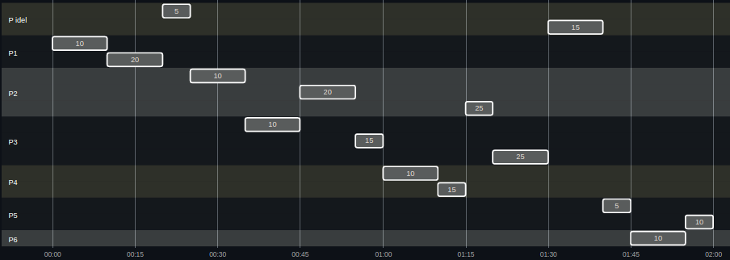

# [2966473] 110-2 Operating System

## Homework Assignment #2

### 108590050 李浩銘

### Written exercises

#### Chap 4

4.2 Under which circumstances does a multithreaded solution using multiple kernel threads provide better performance than a single-threaded solution on a single-processor system?
> Multithreaded solution may allow continued execution if part of process is blocked.

4.4 Can a multithreaded solution using multiple *user*-level threads achieve better performance on a multiprocessor system than on a single-processor system? Explain.
> A multithreaded solution using multiple user-level threads **cannot** achieve better performance on a multiprocessor system than on a single-processor system. Since A multithreaded solution using multiple user-level threads cannot make use of the different processors, The operation system will not schedule the different threads of the process on separate processors.

4.13 Consider a multicore system and a multithreaded program written using the many-to-many threading model. Let the number of user-level threads in the program be greater than the number of processing cores in the system. Discuss the performance implications of the following scenarios.  
a) The number of kernel threads allocated to the program is **less than** the number of processing cores.
> Since the scheduler maps only kernel threads to processors and not user-level threads to processors, some of the processors would remain idle.

(b) The number of kernel threads allocated to the program is **equal** to the number of processing cores.
> All of the processors might be utilized simultaneously, but when a kernel thread is blocked, the corresponding processor would remain idel.

(c) The number of kernel threads allocated to the program is **greater than** the number of processing cores.
> All of the processors might be utilized simultaneously, and when a kernel thread is blocked, it could be substituted by anothere kernel thread.

#### Chap 5

5.6 A variation of the round-robin scheduler is the *regressive round-robin* scheduler.

- This scheduler assigns each process a time quantum and a priority.
- The initial value of a time quantum is 50 milliseconds
- However, every time a process has been allocated to the CPU and uses it entire time quantum (does not block for I/O), 10 milliseconds is added to its time quantum, and its priority level is boosted.
- (The time quantum for a process can be increased to a maximum of 100 milliseconds.)
- When a process blocks before using its entire time quantum, its time quantum is reduced by 5 milliseconds, but its priority remains the same

What type of process (CPU-bound, I/O-bound) does the regressive round-robin scheduler favor? Explain the reasons.
> This regressive round-robin scheduler favor CPU-bound processes, since the time quantum and priority increases when the entire time quantum is consumed. Also, the time quantum decreases when the process is blocked berfore consuming the entire time quantum.

5.8 The following processes are being scheduled using a preemptive round-robin scheduling algorithm. Each process is assigned a numerical priority, with a higher number indicating a higher relative priority. In addition to the processes listed below, the system also has an idle task (which consumes no CPU resources and is identified as Pidle). This task has priority 0 and is scheduled whenever the system has no other available processes to run.

The length of a time quantum is 10 units. If a process is preempted by a higher-priority process, the preempted process is placed at the end of the queue.
  | Thread | Priority | Burst | Arrival |
  |:------:|:--------:|:-----:|:-------:|
  | P1     | 40       | 20    | 0       |
  | P2     | 30       | 25    | 25      |
  | P3     | 30       | 25    | 30      |
  | P4     | 35       | 15    | 60      |
  | P5     | 5        | 10    | 100     |
  | P6     | 10       | 10    | 105     |

a) Show the scheduling order of the processes using a Gantt chart.

> ```mermaid
> gantt
> dateFormat  s
> axisFormat  %M:%S
> 
> Section P idel
>   5 : pi1,  after p12, 5s
>   15: pi2,  after p33, 10s
> 
> Section P1
>   10: p11, 0, 10s
>   20: p12, after p11, 10s
> 
> Section P2
>   10: p21, after pi1, 10s
>   20: p22, after p31, 10s
>   25: p23, after p42, 5s
> 
> Section P3
>   10: p31, after p21, 10s
>   15: p32, after p22, 5s
>   25: p33, after p23, 10s
> 
> Section P4
>   10: p41, after p32, 10s
>   15: p42, after p41, 5s
> 
> Section P5
>   5 : p51, after pi2, 5s
>   10: p52, after p61, 5s
> 
> Section P6
>   10: p61, after p51, 10s
> ```
>
> Above code need mermaid extension. In case it cannot be displayed, an image is provided below
>
> 

b) What is the turnaround time for each process?
> | Thread | Turnaround Time|
> |:------:|:--------------:|
> | P1     | 20             |
> | P2     | 55             |
> | P3     | 60             |
> | P4     | 15             |
> | P5     | 20             |
> | P6     | 10             |

c) What is the waiting time for each process?
> | Thread | Waiting Time|
> |:------:|:-----------:|
> | P1     | 0           |
> | P2     | 30          |
> | P3     | 35          |
> | P4     | 0           |
> | P5     | 10          |
> | P6     | 0           |

d) What is the CPU utilization rate?
> 105/120 = 87.5%

5.10 Which of the following scheduling algorithms could result in starvation?

- First-come, first-served
- Shortest job first
- Round-robin
- Priority

Please explain the reasons.
> Shortest job first. If there are lots of shorter job, then longer jobs may starvation.

5.15 Explain the differences in how much the following scheduling algorithms discriminate in favor of short processes:  
a) FCFS
> Any short jobs arriving after long jobs will have a longer waiting time.

b) RR
> Short jobs will be able to leave the system faster as RR treats all jobs equally.

c) Multilevel feedback queues
> MLFQ works similar to RR, but more dynamic. Therefore, it discriminate favorably toward short jobs.

#### Chap 6

6.4 Explain why implementing synchronization primitives by disabling interrupts is not appropriate in a single-processor system if the synchronization primitives are to be used in user-level programs.
> The user-level program may exclusive the processor and thus exclusive the system. Since the program is able to disable the timer interrupt and prevent context switching.

6.10 The implementation of mutex locks provided in Section 6.5 suffers from busy waiting.  
Describe what changes would be necessary so that a process waiting to acquire a mutex lock would be blocked and placed into a waiting queue until the lock became available.
> When a process executes the `acquire()` operation and finds that the lock not available, the process can block itself and places itself into a waiting queue by calling `block()`.  
> When a process executes the `release()`, it releases the lock and wake up the first process in the waiting queue by calling `wakeup()`.
>
> ```c
> typedef struct {
>   // ...
>   struct process *list;
>   // ...
> } mutex;
> ```
>
> ```c
> acquire() {
>   while (!available) {
>     add this process to the waiting queue: M->list;
>     block();
>   }
>  // ...
> }
> ```
>
> ```c
> release() {
>   available = true;
>   remove a process P from the waiting queue: M->list;
>   wakeup(P);
> }
> ```

6.11 Assume that a system has multiple processing cores. For each of the following scenarios, describe which is a better locking mechanism – a spinlock or a mutex lock where waiting processes sleep while waiting for the lock to become available:

- The lock is to be held for a short duration.
- The lock is to be held for a long duration.
- A thread may be put to sleep while holding the lock.

> If the lock is to be held for a short duration, then spinlock is a better locking mechanism.  
> If the lock is to be held for a long duration, then mutex lock is a better locking mechanism.  
> If a thread may be put to sleep while holding the lock, which means it will hold for a long duration, then mutex lock is a better locking mechanism.

### Programming exercises

#### Programming problems

- [Chap 4.17](./Chap4.17/README.md)
- [Chap 4.21](./Chap4.21/README.md)
- [Chap 6.33](./Chap6.33/README.md)

#### Programming projects

- [Chap.4 Project 1](./Chap4Project1/README.md)
- [Chap.4 Project 2](./Chap4Project2/README.md)
- [Chap.6 Project 2](./Chap6Project2/README.md)
- [Chap.6 Project 3](./Chap6Project3/README.md)
