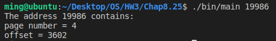

# [2966473] 110-2 Operating System

## Homework Assignment #3

### 108590050 李浩銘

#### Programming problem 8.25

Implement your solution to Exercise 7.15 using POSIX synchronization (or Java if you want).

- In particular, represent northbound and southbound farmers as separate threads. Once a farmer is on the bridge, the associated thread will sleep for a random period of time, representing traveling across the bridge.
- Design your program so that you can create several threads representing the northbound and southbound farmers.

### Development Environment

- Operating System: Ubuntu 18.04.6 LTS
- Kernel Version: 5.4.0-104-generic
- Compiler Version: gcc 7.5.0

### Build

To compile the source files

```bash
make
```

To clean the object and binary files

```bash
make clean
```

### Usage

Basic usage

```bash
./bin/main <address>
```

### Execution snapshot


