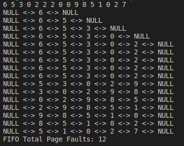

# [2966473] 110-2 Operating System

## Homework Assignment #3

### 108590050 李浩銘

#### Programming problem 8.25

Write a program that implements the `FIFO`, `LRU`, and `optimal` page-replacement algorithms presented in this chapter. First, generate a random page-reference string where page numbers range from 0 to 9. Apply the random page-reference string to each algorithm, and record the number of page faults incurred by each algorithm. Implement the replacement algorithm so that the number of page frames can vary from 1 to 7. Assume that demand paging is used.

### Development Environment

- Operating System: Ubuntu 18.04.6 LTS
- Kernel Version: 5.4.0-104-generic
- Compiler Version: gcc 7.5.0

### Build

To compile the source files

```bash
make
```

To clean the object and binary files

```bash
make clean
```

### Usage

```bash
./bin/main
```

```bash
./bin/main <frameSize>
```

### Execution snapshot




