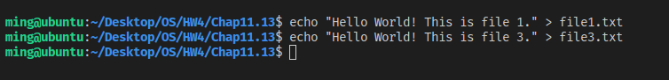
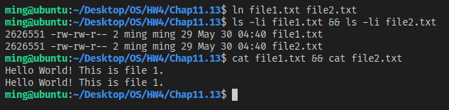
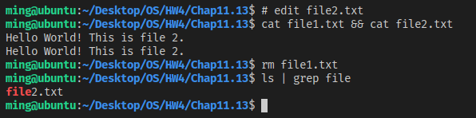
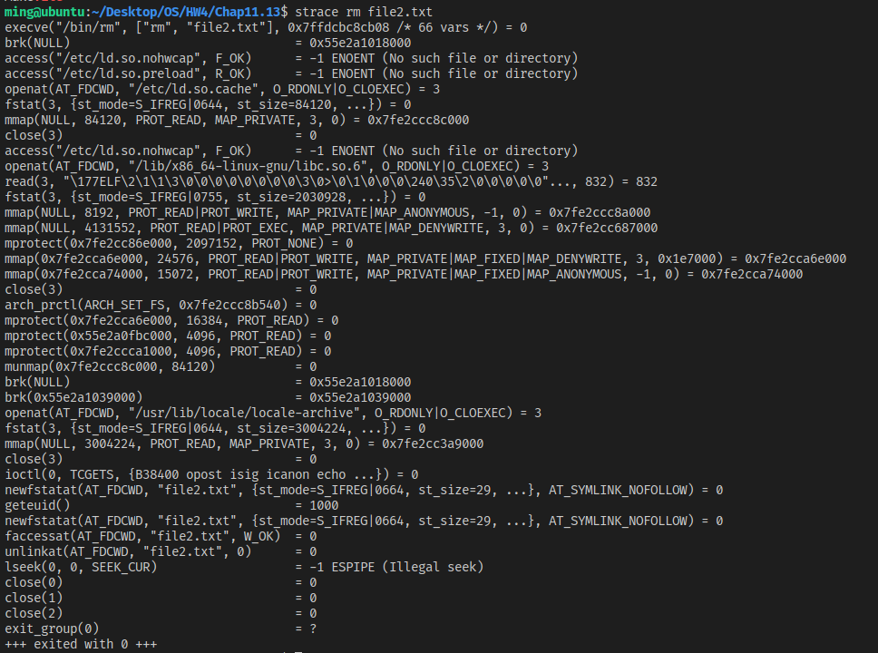
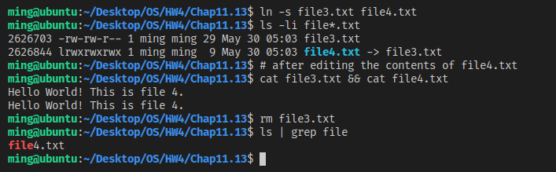

# [2966473] 110-2 Operating System

## Homework Assignment #4

### 108590050 李浩銘

#### Programming problem 11.13

This exercise examines the relationship between files and inodes on a UNIX or Linux system. You can complete this exercise on the Linux virtual machine that is provided with this text.

- (1) In the source code available with this text, open file1.txt and examine its contents. Next, obtain the inode number of this file with the command: *ls –li file1.txt*  
Create a hard link between file1.txt and file2.txt: *ln file1.txt file2.txt*  
What are the inode values of file1.txt and file2.txt? Are they the same or different? Do the two files have the same or different contents?

- (2) Next, edit file2.txt and change its contents. Examine the contents of file1.txt. Are the contents of file1.txt and file2.txt the same or different? Next, remove file1.txt. Does file2.txt still exist as well? Check what system call is used for removing file2.txt by the following command: *strace rm file2.txt*.

- (3) Create a soft link to file3.txt by the following command: *ln –s file3.txt file4.txt*  
Are the inode numbers of file3.txt and file4.txt the same, or is each unique? Next, edit the contents of file4.txt. Have the contents of file3.txt been altered as well? Last, delete file3.txt. Explain what happens when you attempt to edit file4.txt.

### Development Environment

- Operating System: Ubuntu 18.04.6 LTS
- Kernel Version: 5.4.0-104-generic
- Compiler Version: gcc 7.5.0

### Execution snapshot

> **file1.txt** and **file2.txt** have the same inode values of `2626551`.  
> The two files have the `same` contents.

> The contents of **file1.txt** and **file2.txt** are `same` after editing the contents of **file2.txt**.  
> **file2.txt** still exist after remove **file1.txt**.

> Thesystem call `unlinkat()` is used for removing **file2.txt**

> The inode number of **file3.txt** is `2626703` and the inode number of **file4.txt** is `2626884`, they are `different`.
> The contents of **file3.txt** has been altered as well after edited the contents of **file4.txt**.
> However, **file4.txt** still exist after removed **file3.txt**.
