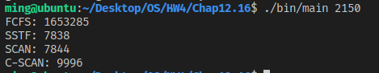

# [2966473] 110-2 Operating System

## Homework Assignment #4

### 108590050 李浩銘

#### Programming problem 12.16

Write a program that implements the following disk-scheduling algorithms:

- (a) FCFS
- (b) SSTF
- (c) SCAN
- (d) C-SCAN

Your program will be passed the initial position of the disk head (as a parameter on the command line) and report the total amount of head movement required by each algorithm.

### Development Environment

- Operating System: Ubuntu 18.04.6 LTS
- Kernel Version: 5.4.0-104-generic
- Compiler Version: gcc 7.5.0

### Build

To compile the source files

```bash
make
```

To clean the object and binary files

```bash
make clean
```

### Usage

```bash
./bin/main <init pos of disk head>
```

### Execution snapshot


